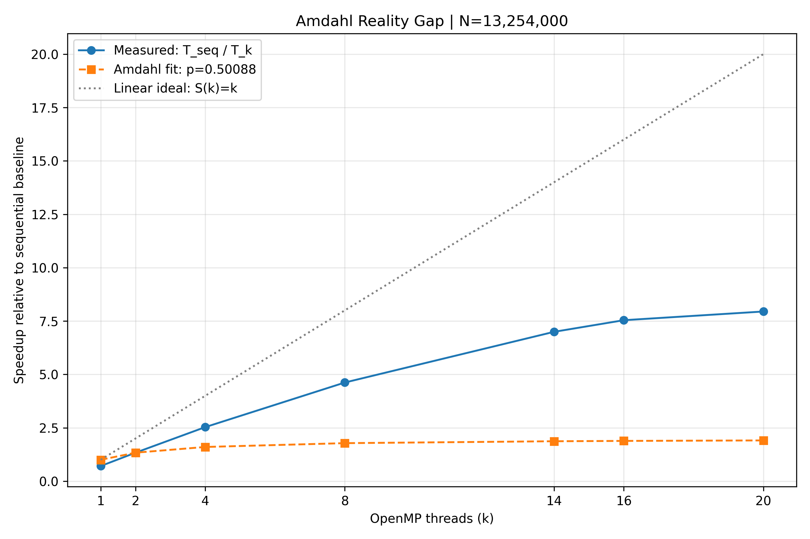

# Week 4 Answers — The Amdahl Reality Gap

Empirical speedup fitting, false sharing, and loop scheduling in OpenMP.

This answersheet uses the completed laptop run in
[`runs/20260924_121506_410`](runs/20260924_121506_410/).
All reported benchmark times come from that session; diagnostic profile timings
are identified separately.

## 1. Student and machine information

| Required field | Recorded information |
|---|---|
| Student full name | ____________________ (not supplied) |
| Student ID entered for this run | 3254 |
| Institutional email / Git URL | ____________________ (not supplied) |
| Practicum date | 24 September 2026 |
| Recorded benchmark interval | 07:15:06–07:15:38 UTC; 12:15:06–12:15:38 at UTC+05:00 |
| Assigned practicum slot | ____________________ (not recorded in the logs) |
| Laptop | ASUS ROG Strix G614JV_G614JV |
| Operating system | Windows 11 Home Single Language, 64-bit, version 10.0.26200 |
| CPU and generation | Intel Core i7-13650HX, 13th generation, Raptor Lake |
| Physical cores | 14: 6 Performance-cores and 8 Efficient-cores |
| Logical threads | 20; `omp_get_max_threads()` and `omp_get_num_procs()` both report 20 |
| L1 / L2 cache line size | 64 bytes, as reported by the Windows cache query |
| Installed memory modules | Two 8 GiB modules; reported configured speed 4800 |
| Compiler | GCC 16.1.0, MSYS2 build |
| Compilation flags | `-O2 -fopenmp -std=c11 -Wall -Wextra` |
| OpenMP configuration | `OMP_DYNAMIC=FALSE`, `OMP_NUM_THREADS=20`; default runtime affinity |
| Target workload N | 13,254,000 starting integers |

The laptop details and cache line sizes come from
[`hw_info.txt`](runs/20260924_121506_410/hw_info.txt).
The P/E breakdown and generation are confirmed by
[Intel's i7-13650HX specifications](https://www.intel.com/content/www/us/en/products/sku/232101/intel-core-i713650hx-processor-24m-cache-up-to-4-90-ghz/specifications.html).
Power mode, temperatures, background activity, and the full practicum duration
were not recorded. The benchmark interval above does not establish the duration
of the whole lab session.

## 2. Workload derivation and correctness

Using the recorded student ID's last four digits:

```text
N = 10,000,000 + (3254 × 1,000)
  = 13,254,000
```

For each integer `i` from 1 through N, the kernel counts the steps to reach 1:
divide an even value by 2; replace an odd value with `3*n + 1`.
The program finds the maximum stopping time, sums the stopping times modulo
1,000,000,007, and counts how many starting integers require more than 100 steps.

| Verification result | Value |
|---|---:|
| Maximum stopping time | 688 |
| Checksum modulo 1,000,000,007 | 96,515,714 |
| Starting integers requiring more than 100 steps | 10,684,763 |
| Raw benchmark repetitions | 45 across 15 configurations |
| Agreement between sequential and parallel results | All 45 repetitions match |
| Requested versus actual OpenMP thread counts | Match in every recorded repetition |

The separate scheduling profiles each account for all **13,254,000** iterations
and **2,096,515,728** total Collatz steps. This independently checks the profile
totals against the recorded checksum:

```text
2,096,515,728 mod 1,000,000,007 = 96,515,714
```

[`session.json`](runs/20260924_121506_410/session.json) reports `complete`.
Its recorded SHA-256 hashes match the source and local automation files used for
this run. The three C source/header files are included in this submission;
the runner and analysis helpers remain in the local working folder. The
[`console log`](runs/20260924_121506_410/console_log.txt) also records successful
completion and agreement with the sequential baseline.

## 3. Measurement method and sequential baseline

Each configuration was executed three times. Run 1 was discarded as the warm-up;
the arithmetic mean of runs 2 and 3 is the reported time. Timings use
`omp_get_wtime()`. The first run was not preceded by an explicit cache flush, so
the worksheet's cold-run label does not establish that every cache was cold.

The runtime reports `omp_get_wtick() = 0.001 s`: **1 ms resolution**. Printing
nine decimal places does not establish nanosecond or sub-microsecond precision.
Times below are rounded to six decimal places for readability; the original
values remain in [`results.csv`](runs/20260924_121506_410/results.csv).

| Sequential Run 1, discarded (s) | Run 2 (s) | Run 3 (s) | T_seq (s) |
|---:|---:|---:|---:|
| 2.039000 | 1.989000 | 1.984000 | 1.986500 |

```text
T_seq = (1.989000082 + 1.983999968) / 2
      = 1.986500025 s
```

The true sequential loop is distinct from the one-thread OpenMP loop. Empirical
speedup uses **T_seq**, not the OpenMP one-thread time. Profile bookkeeping runs
were performed separately and are excluded from all benchmark averages.

## 4. Table 1 — Scaling and the Amdahl fit

```text
T_k = (Run 2 + Run 3) / 2
S_emp(k) = T_seq / T_k

S_emp(2) = 1.986500025 / 1.488999963
         = 1.334117

1 / S(2) = (1 - p) + p/2 = 1 - p/2
p = 2 × (1 - 1/S_emp(2))
  = 0.500881003
  = 50.0881003%

S_theo(k) = 1 / [(1 - p) + p/k]
Delta(k) = S_theo(k) - S_emp(k)
Linear ideal: S(k) = k
```

| Threads k | Run 1, discarded (s) | Run 2 (s) | Run 3 (s) | Average T_k (s) | S_emp(k) | S_theo(k) | Delta(k) |
|---:|---:|---:|---:|---:|---:|---:|---:|
| 1 | 2.803000 | 2.814000 | 2.800000 | 2.807000 | 0.707695 | 1.000000 | 0.292305 |
| 2 | 1.482000 | 1.491000 | 1.487000 | 1.489000 | 1.334117 | 1.334117 | 0.000000 |
| 4 | 0.791000 | 0.796000 | 0.773000 | 0.784500 | 2.532186 | 1.601693 | -0.930493 |
| 8 | 0.443000 | 0.414000 | 0.446000 | 0.430000 | 4.619768 | 1.780217 | -2.839551 |
| 14 | 0.296000 | 0.280000 | 0.288000 | 0.284000 | 6.994717 | 1.869522 | -5.125196 |
| 16 | 0.267000 | 0.267000 | 0.260000 | 0.263500 | 7.538900 | 1.885284 | -5.653616 |
| 20 | 0.226000 | 0.241000 | 0.259000 | 0.250000 | 7.946000 | 1.907803 | -6.038197 |

The required powers of two are supplemented by **14 physical cores** and
**20 logical threads**. This table uses static scheduling throughout.
The largest measured speedup in this scaling series is **7.946000× at 20 threads**.



Negative gaps mean measured speedup is **above** the fitted theoretical curve.
The two-thread fit has a formal infinite-thread limit of about **2.00353×**, yet
the measured scaling series exceeds it from four threads onward. This shows
that the fitted p does not describe a fixed physical serial fraction for this
implementation across all thread counts; it is not a violation of Amdahl's law.

## 5. Table 2 — False sharing

Both variants use static scheduling with **14 threads**, equal to the recorded
physical core count. Both return the same maximum, checksum, and hit count.
The mitigated implementation uses an OpenMP reduction.

| Variant | Threads | Run 1, discarded (s) | Run 2 (s) | Run 3 (s) | Average time (s) | Throughput (iterations/s) | Time / reduction time |
|---|---:|---:|---:|---:|---:|---:|---:|
| Naive adjacent counters | 14 | 0.334000 | 0.326000 | 0.335000 | 0.330500 | 40,102,873.64 | 1.167845 |
| OpenMP reduction | 14 | 0.278000 | 0.287000 | 0.279000 | 0.283000 | 46,833,923.50 | 1.000000 |

```text
Throughput = N / average time
Penalty ratio = T_naive / T_reduction
              = 0.3305000065 / 0.2829999925
              = 1.167845
```

The naive variant is **16.78% slower** than the reduction variant. Switching to
reduction reduces elapsed time by **14.37%**, or approximately **0.0475 s**.

## 6. Table 3 — Scheduling and workload distribution

All five schedules use **20 threads** and the same reduction-based kernel.
The runtime schedule is selected through `omp_set_schedule()` and applied by
`schedule(runtime)`.

| OpenMP schedule | Chunk size | Run 1, discarded (s) | Run 2 (s) | Run 3 (s) | Average time (s) |
|---|---|---:|---:|---:|---:|
| `static` | Default: 662,700 iterations per thread | 0.235000 | 0.233000 | 0.221000 | 0.227000 |
| `static, 1000` | 1,000 | 0.241000 | 0.229000 | 0.251000 | 0.240000 |
| `dynamic, 100` | 100 | 0.202000 | 0.197000 | 0.200000 | 0.198500 |
| `dynamic, 10000` | 10,000 | 0.199000 | 0.200000 | 0.199000 | 0.199500 |
| `guided` | Decreasing chunks; default minimum | 0.216000 | 0.196000 | 0.211000 | 0.203500 |

The following observations use the separate
[`thread_profiles.csv`](runs/20260924_121506_410/thread_profiles.csv) diagnostic
passes. Ranges describe the 20 worker threads within each pass.

| Schedule | Iterations per thread, min–max | Active loop time, min–max (s) | Observed distribution |
|---|---:|---:|---|
| `static` | 662,700–662,700 | 0.141–0.229 | Equal iteration counts, but total Collatz work varies from 84.27 to 111.53 million steps; completion times differ substantially. |
| `static, 1000` | 662,000–663,000 | 0.145–0.250 | Round-robin chunks bring work close to 104.19–105.57 million steps per thread, but completion times remain uneven. |
| `dynamic, 100` | 510,000–819,400 | 0.200–0.201 | Unequal iteration assignments accompany closely grouped completion times. |
| `dynamic, 10000` | 410,000–960,000 | 0.215–0.218 | Coarser work redistribution also gives closely grouped completion times. |
| `guided` | 435,245–918,588 | 0.195–0.223 | Adaptive chunks redistribute work, although a longer tail remains in this diagnostic pass. |

These measurements describe assigned work and active elapsed time, not direct
CPU utilization. Thread IDs were not mapped to P/E cores or SMT siblings.
The diagnostic passes are not additional repetitions for Table 3 and must not
be averaged into it. Table 3's static result is a separate measurement group
from Table 1's static 20-thread result; their averages are retained separately.

## 7. Q1 — Micro-architectural root cause of false sharing

The naive implementation showed a **1.167845× penalty**, rather than the massive
degradation assumed in the question. This CPU's recorded L1/L2 cache line size
is **64 bytes**. With 4-byte `int` counters and a 64-byte-aligned array, the
14 active counters occupy 56 bytes within one cache line. Although each worker
updates a different counter, workers executing on different cores contend for
ownership of that line.

In the **MESI** model, a core must obtain exclusive write ownership and modifies
the line into the Modified state. A later writer on another core requires an
ownership transfer that invalidates the previous core's copy. Repeated transfers
cause coherence requests, invalidation traffic, and stalls on the interconnect
(the worksheet's bus traffic). MOESI adds an Owned state, but it also requires
single-writer ownership; it does not eliminate false sharing. MESI is used here
as the explanatory model, without claiming the logs identify this processor's
complete coherence implementation. See
[Intel's explanation of coherent cache-line ownership](https://www.intel.com/content/www/us/en/developer/articles/technical/fast-core-to-core-communications.html).

The reduction accumulates private hit counts and combines them at the end,
avoiding repeated shared-line updates. The naive counters are `volatile` to
preserve repeated writes under optimization, so the comparison also includes
memory-access overhead removed by the reduction. No hardware invalidation
counters were collected; the measured penalty cannot be attributed exclusively
to cache coherence.

## 8. Q2 — Hyperthreading, SMT saturation, and physical core ceilings

**No, speedup did not continue to grow linearly from 14 to 20 threads.**
The time fell from **0.284000 s to 0.250000 s**, and speedup increased from
**6.994717× to 7.946000×**. This is a **13.60% throughput increase** for a
**42.86% increase in worker count**. Continuing ideal proportional scaling from
the 14-thread point would predict approximately **0.198800 s** at 20 threads,
which was not achieved.

The CPU has six P-cores and eight E-cores, with 20 logical threads in total.
On this hybrid design, the six additional hardware threads come from the
P-cores' SMT capability; they are not six additional physical cores. SMT siblings
share execution units, caches, and paths to memory, while retaining their own
architectural register state. Consequently, another SMT worker can use otherwise
idle capacity but cannot duplicate a core's compute resources. These shared
resource properties are described in
[Intel's Hyper-Threading documentation](https://edc.intel.com/content/www/us/en/design/ipla/software-development-platforms/client/platforms/alder-lake-desktop/12th-generation-intel-core-processors-datasheet-volume-1-of-2/001/intel-hyper-threading-technology/).

The smaller gain is consistent with shared execution resources, differing P/E
core performance, and synchronization or workload imbalance. However, runtime
affinity was left at its default, so 14 software threads do not prove one worker
was placed on each physical core. These results therefore show diminishing
returns at the physical/logical count boundary, not a controlled isolation of
SMT's contribution.

## 9. Q3 — Empirical versus theoretical Amdahl discrepancy

The required two-thread fit gives **p = 0.500881003**, or **50.0881%**.
At eight threads, theoretical speedup is **1.780217×** while measured speedup
is **4.619768×**, giving **Delta(8) = -2.839551**. At 16 threads, the values
are **1.885284×** and **7.538900×**, giving **Delta(16) = -5.653616**.
The fitted curve therefore **underpredicts** measured speedup in this run.

A fixed two-parameter workload split does not capture all differences between
the sequential and OpenMP implementations. The one-thread OpenMP time is
**2.807000 s**, approximately **41.30% longer** than the sequential baseline.
This measured difference shows that an OpenMP execution has costs or execution
characteristics absent from the sequential measurement. Deriving p from only
the two-thread result folds those effects into an apparent serial fraction;
that fraction is not demonstrated to remain constant as more workers are used.

Two physical factors omitted from the simple model are:

1. **Unequal core throughput and placement.** P-cores and E-cores are different
   execution resources. The mix of cores used, worker migration, and unequal
   Collatz work can change completion times and barrier waiting as k changes.
2. **SMT resource contention.** Sibling logical threads share a core's execution
   capacity and caches, so each additional logical worker does not contribute
   another identical independent processor.

These are plausible contributors given the hardware and profiles, rather than
individually measured causes. OpenMP scheduling/reduction overhead and unmeasured
clock or power changes can also affect the fit. The data do not establish
memory-bandwidth saturation or a literal 49.91% inherently serial algorithm.

## 10. Q4 — Scheduling trade-offs and queue contention

`dynamic(100)` averaged **0.198500 s**, `dynamic(10000)` averaged **0.199500 s**,
and default `static` averaged **0.227000 s**. The dynamic schedules reduce time
relative to static by approximately **12.56%** and **12.11%**, respectively.
The smallest mean belongs to `dynamic(100)`, but its approximately **1 ms**
advantage over `dynamic(10000)` equals the reported timer tick and lies within
the observed repetition variation. These two measured averages are too close
to establish a reliable performance ranking from two retained runs each.

With N = 13,254,000, chunks of 100 create approximately **132,540 chunks**, while
chunks of 10,000 create **1,326 chunks**. The smaller chunk requires many more
work-distribution requests but can balance uneven work more finely. The profiles
show both dynamic policies assigning different numbers of iterations to workers
while keeping completion times close. Even though `static(1000)` balances the
total number of Collatz steps well, it cannot reassign work from slower workers
and averaged **0.240000 s**.

**Neither tested dynamic chunk size demonstrated queue-contention overhead
outweighing the net benefit of balancing relative to static.** Both were faster
than static in this session. Therefore, no crossover chunk size can be identified
from these data. Queue or lock contention was not directly measured; identifying
a threshold would require more chunk sizes, additional repetitions, and suitable
profiling. It would be unsupported to claim that chunk size 100 caused a net
slowdown here.

## 11. Source code, reproduction, and submission assets

The complete source is in [`collatz.c`](collatz.c),
[`collatz_seq.c`](collatz_seq.c), and [`collatz_common.h`](collatz_common.h).
Both `.c` files contain compilation instructions in their header comments.
Compile with an OpenMP-enabled GCC:

```powershell
gcc -O2 -fopenmp -std=c11 -Wall -Wextra collatz_seq.c -o collatz_seq.exe
gcc -O2 -fopenmp -std=c11 -Wall -Wextra collatz.c -o collatz.exe
```

The local `run_lab.ps1` helper captured hardware, built the programs, ran the
correctness self-test, and created the benchmark directory. The local
`analyze_results.py` helper derived the tables and plot. These helpers and the
setup README are excluded from the submission; the required C source is included.
To reproduce the computation manually after compilation, run from this folder:

```powershell
New-Item -ItemType Directory -Path rerun
.\collatz.exe 3254 14 rerun
```

This uses the recorded ID and physical core count. It writes new raw measurements
to `rerun` without replacing the submitted dataset. GCC and its OpenMP runtime
must be available in the terminal's PATH.

| Required deliverable | File included with this answersheet |
|---|---|
| Hardware specification | [`hw_info.txt`](runs/20260924_121506_410/hw_info.txt) |
| Full source and compilation instructions | [`collatz.c`](collatz.c), [`collatz_seq.c`](collatz_seq.c), [`collatz_common.h`](collatz_common.h) |
| Raw benchmark dataset for Tables 1–3 | [`results.csv`](runs/20260924_121506_410/results.csv) |
| High-resolution scalability graph | [`speedup_plot.png`](runs/20260924_121506_410/speedup_plot.png) |
| Written answers Q1–Q4 | Sections 7–10 of this file and [`analysis.pdf`](analysis.pdf) |
| Supporting run metadata and diagnostics | [`session.json`](runs/20260924_121506_410/session.json), [`console_log.txt`](runs/20260924_121506_410/console_log.txt), [`thread_profiles.csv`](runs/20260924_121506_410/thread_profiles.csv) |

Fill in the missing name, email/Git URL, and assigned slot before submission.
The worksheet explicitly requests `analysis.pdf` or written worksheet answers;
`analysis.pdf` is an export of this answersheet. After changing personal details,
export it again to keep the PDF and Markdown consistent. Keep this Markdown
version in the repository along with its linked run files. The worksheet
allows a private repository with instructor access or a `lab1_[StudentID].tar.gz`
archive. Repository access and publishing are separate from the measured results.
