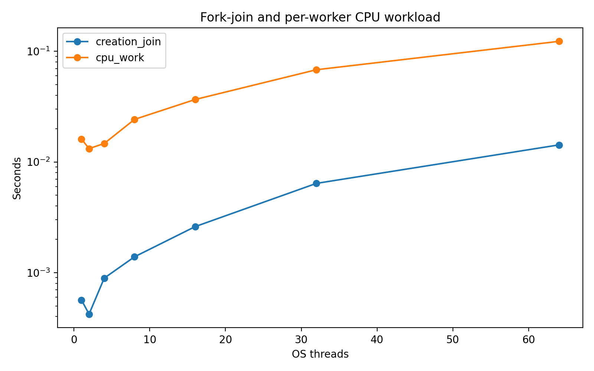
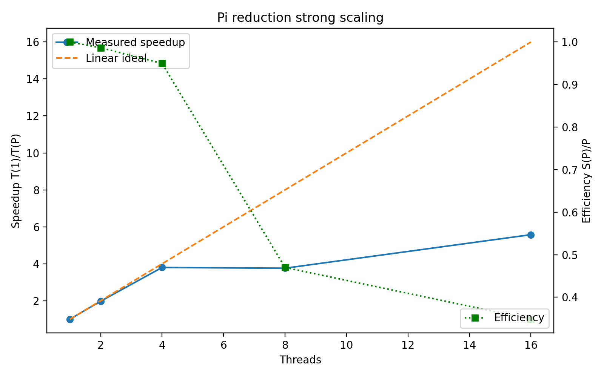
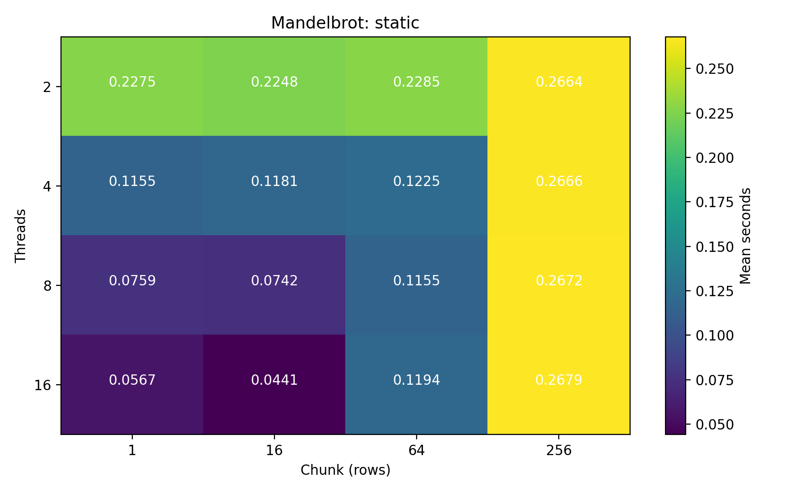
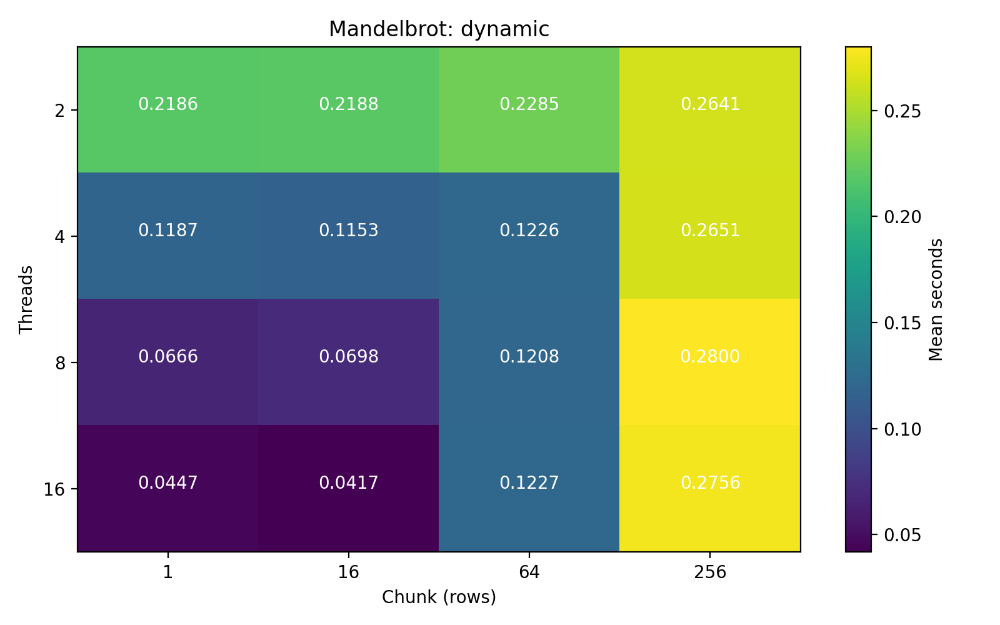
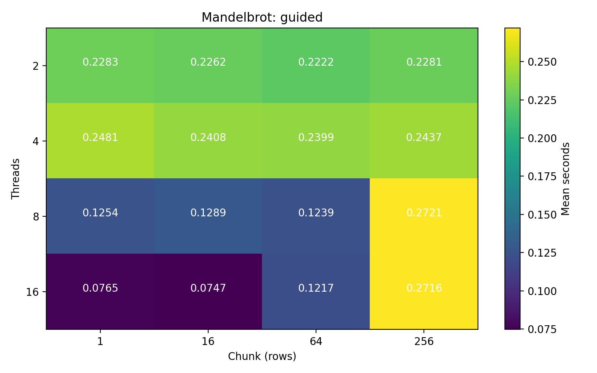
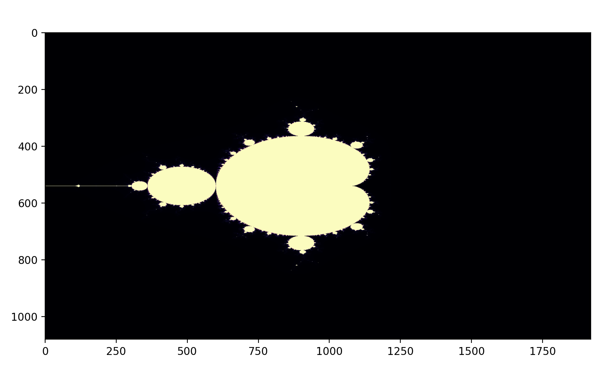
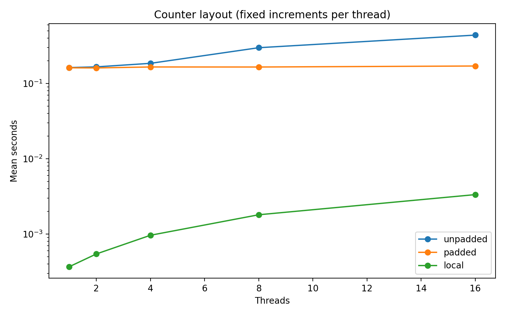
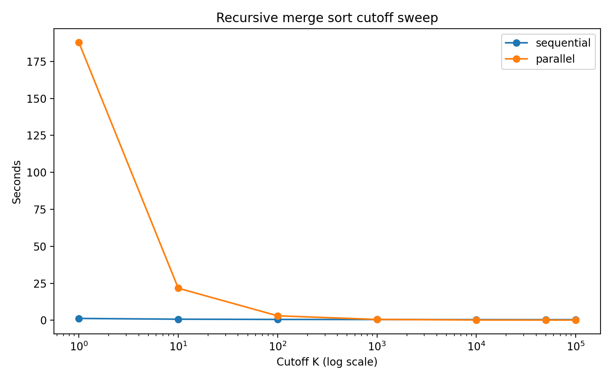
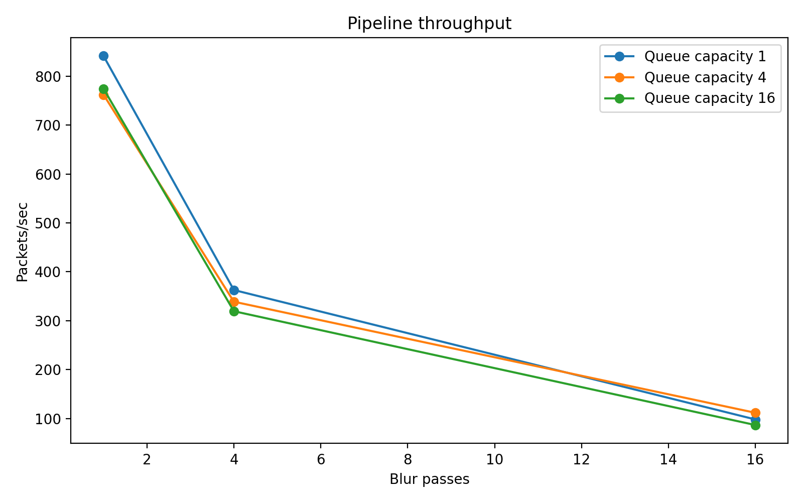

OpenMP Paradigms - Python Practice Report

Mode: full; status: complete; started: 2026-09-25T09:06:44.231724+05:00

Student name / ID: Ainabek Aisultan / 230103254.


I. System & Hardware Specifications

{
  "cpu": "Intel64 Family 6 Model 183 Stepping 1, GenuineIntel",
  "physical_cores": 14,
  "logical_cpus": 20,
  "ram_bytes": 16780582912,
  "os": "Windows-11-10.0.26200-SP0",
  "python": "3.13.7 (tags/v3.13.7:bcee1c3, Aug 14 2025, 14:15:11) [MSC v.1944 64 bit (AMD64)]",
  "numpy": "2.2.3",
  "numba": "0.66.0",
  "matplotlib": "3.10.7",
  "numba_pool_capacity": 20,
  "timer": "time.perf_counter",
  "timer_resolution_seconds": 1e-07,
  "cache_info": [
    {
      "level": 1,
      "bytes": 49152,
      "line_bytes": 64,
      "type": 2,
      "logical_cpu_mask": 3
    },
    {
      "level": 1,
      "bytes": 32768,
      "line_bytes": 64,
      "type": 1,
      "logical_cpu_mask": 3
    },
    {
      "level": 2,
      "bytes": 1310720,
      "line_bytes": 64,
      "type": 0,
      "logical_cpu_mask": 3
    },
    {
      "level": 1,
      "bytes": 49152,
      "line_bytes": 64,
      "type": 2,
      "logical_cpu_mask": 12
    },
    {
      "level": 1,
      "bytes": 32768,
      "line_bytes": 64,
      "type": 1,
      "logical_cpu_mask": 12
    },
    {
      "level": 2,
      "bytes": 1310720,
      "line_bytes": 64,
      "type": 0,
      "logical_cpu_mask": 12
    },
    {
      "level": 1,
      "bytes": 49152,
      "line_bytes": 64,
      "type": 2,
      "logical_cpu_mask": 48
    },
    {
      "level": 1,
      "bytes": 32768,
      "line_bytes": 64,
      "type": 1,
      "logical_cpu_mask": 48
    },
    {
      "level": 2,
      "bytes": 1310720,
      "line_bytes": 64,
      "type": 0,
      "logical_cpu_mask": 48
    },
    {
      "level": 1,
      "bytes": 49152,
      "line_bytes": 64,
      "type": 2,
      "logical_cpu_mask": 192
    },
    {
      "level": 1,
      "bytes": 32768,
      "line_bytes": 64,
      "type": 1,
      "logical_cpu_mask": 192
    },
    {
      "level": 2,
      "bytes": 1310720,
      "line_bytes": 64,
      "type": 0,
      "logical_cpu_mask": 192
    },
    {
      "level": 1,
      "bytes": 49152,
      "line_bytes": 64,
      "type": 2,
      "logical_cpu_mask": 768
    },
    {
      "level": 1,
      "bytes": 32768,
      "line_bytes": 64,
      "type": 1,
      "logical_cpu_mask": 768
    },
    {
      "level": 2,
      "bytes": 1310720,
      "line_bytes": 64,
      "type": 0,
      "logical_cpu_mask": 768
    },
    {
      "level": 1,
      "bytes": 49152,
      "line_bytes": 64,
      "type": 2,
      "logical_cpu_mask": 3072
    },
    {
      "level": 1,
      "bytes": 32768,
      "line_bytes": 64,
      "type": 1,
      "logical_cpu_mask": 3072
    },
    {
      "level": 2,
      "bytes": 1310720,
      "line_bytes": 64,
      "type": 0,
      "logical_cpu_mask": 3072
    },
    {
      "level": 1,
      "bytes": 32768,
      "line_bytes": 64,
      "type": 2,
      "logical_cpu_mask": 4096
    },
    {
      "level": 1,
      "bytes": 65536,
      "line_bytes": 64,
      "type": 1,
      "logical_cpu_mask": 4096
    },
    {
      "level": 1,
      "bytes": 32768,
      "line_bytes": 64,
      "type": 2,
      "logical_cpu_mask": 8192
    },
    {
      "level": 1,
      "bytes": 65536,
      "line_bytes": 64,
      "type": 1,
      "logical_cpu_mask": 8192
    },
    {
      "level": 1,
      "bytes": 32768,
      "line_bytes": 64,
      "type": 2,
      "logical_cpu_mask": 16384
    },
    {
      "level": 1,
      "bytes": 65536,
      "line_bytes": 64,
      "type": 1,
      "logical_cpu_mask": 16384
    },
    {
      "level": 1,
      "bytes": 32768,
      "line_bytes": 64,
      "type": 2,
      "logical_cpu_mask": 32768
    },
    {
      "level": 1,
      "bytes": 65536,
      "line_bytes": 64,
      "type": 1,
      "logical_cpu_mask": 32768
    },
    {
      "level": 2,
      "bytes": 2097152,
      "line_bytes": 64,
      "type": 0,
      "logical_cpu_mask": 61440
    },
    {
      "level": 1,
      "bytes": 32768,
      "line_bytes": 64,
      "type": 2,
      "logical_cpu_mask": 65536
    },
    {
      "level": 1,
      "bytes": 65536,
      "line_bytes": 64,
      "type": 1,
      "logical_cpu_mask": 65536
    },
    {
      "level": 1,
      "bytes": 32768,
      "line_bytes": 64,
      "type": 2,
      "logical_cpu_mask": 131072
    },
    {
      "level": 1,
      "bytes": 65536,
      "line_bytes": 64,
      "type": 1,
      "logical_cpu_mask": 131072
    },
    {
      "level": 1,
      "bytes": 32768,
      "line_bytes": 64,
      "type": 2,
      "logical_cpu_mask": 262144
    },
    {
      "level": 1,
      "bytes": 65536,
      "line_bytes": 64,
      "type": 1,
      "logical_cpu_mask": 262144
    },
    {
      "level": 1,
      "bytes": 32768,
      "line_bytes": 64,
      "type": 2,
      "logical_cpu_mask": 524288
    },
    {
      "level": 1,
      "bytes": 65536,
      "line_bytes": 64,
      "type": 1,
      "logical_cpu_mask": 524288
    },
    {
      "level": 2,
      "bytes": 2097152,
      "line_bytes": 64,
      "type": 0,
      "logical_cpu_mask": 983040
    },
    {
      "level": 3,
      "bytes": 25165824,
      "line_bytes": 64,
      "type": 0,
      "logical_cpu_mask": 1048575
    }
  ],
  "environment": {
    "NUMBA_NUM_THREADS": "20",
    "NUMBA_THREADING_LAYER": null,
    "OMP_NUM_THREADS": null
  },
  "windows_processor_kib": {
    "Name": "13th Gen Intel(R) Core(TM) i7-13650HX",
    "NumberOfCores": 14,
    "NumberOfLogicalProcessors": 20,
    "L2CacheSize": 11776,
    "L3CacheSize": 24576
  },
  "cache_type_key": {
    "0": "unified",
    "1": "instruction",
    "2": "data",
    "3": "trace"
  }
}


II. Experimental Methodology

Native kernels are JIT-compiled before their benchmark timers. Timings use perf_counter. Lab 1 team creation has 3 trials and CPU work has 1; Lab 2 has 5 trials; Labs 3 and 4 have 3; Labs 5 and 6 have 1 per configuration. Means retain all measured trials. Thread-based measurements include creation, barriers and joining. Numba reduction uses a warmed persistent pool. Sort input copies and correctness checks are outside timing; sort task creation and pool startup are inside. CPU utilization is system-wide, not process-only. Affinity, power and temperature are not controlled. Repeated measurements should be interpreted with their variability.

Quick mode uses smaller inputs to validate the software. Full mode uses the manual sizes. A quick report is not evidence for the required full-size experiments.

Python Lock timings include interpreter/GIL costs. Race and cache experiments use separate relaxed atomic loads/stores to preserve real memory accesses, but the combined read/add/write is not atomic. Custom schedulers and the sort executor emulate the patterns; they are not OpenMP scheduling or work stealing.


III. Empirical Results & Visualizations


Lab 1: 28 measured configurations/trials.

Raw data: lab1/timings.csv

Configuration | trials | mean seconds | sample standard deviation

creation_join, 1 | 3 | 0.000565367 | 4.50591e-05

cpu_work, 1 | 1 | 0.0161216 | not estimated (one trial)

creation_join, 2 | 3 | 0.000421433 | 1.09546e-05

cpu_work, 2 | 1 | 0.0132042 | not estimated (one trial)

creation_join, 4 | 3 | 0.000891167 | 0.000145424

cpu_work, 4 | 1 | 0.0146842 | not estimated (one trial)

creation_join, 8 | 3 | 0.00139 | 0.000370705

cpu_work, 8 | 1 | 0.0242527 | not estimated (one trial)

creation_join, 16 | 3 | 0.00260403 | 0.000847012

cpu_work, 16 | 1 | 0.0366909 | not estimated (one trial)

creation_join, 32 | 3 | 0.00640463 | 0.000742006

cpu_work, 32 | 1 | 0.0681665 | not estimated (one trial)

creation_join, 64 | 3 | 0.014263 | 0.000393354

cpu_work, 64 | 1 | 0.123069 | not estimated (one trial)


Lab 2: 80 measured configurations/trials.

Raw data: lab2/timings.csv

Configuration | trials | mean seconds | sample standard deviation

serial_native, 1, 100000000 | 5 | 0.176563 | 0.00367474

race, 1, 100000000 | 5 | 0.195185 | 0.00267245

race, 2, 100000000 | 5 | 0.113166 | 0.00165501

race, 4, 100000000 | 5 | 0.0551437 | 0.000383984

race, 8, 100000000 | 5 | 0.0470775 | 0.000601344

serial_python, 1, 1000000 | 5 | 0.0585011 | 0.000776953

serial_native_lock_n, 1, 1000000 | 5 | 0.00171266 | 2.43043e-05

critical_python, 1, 1000000 | 5 | 0.171163 | 0.00460073

critical_python, 2, 1000000 | 5 | 0.174358 | 0.00345359

critical_python, 4, 1000000 | 5 | 0.169117 | 0.00125667

critical_python, 8, 1000000 | 5 | 0.172554 | 0.00355024

reduction, 1, 100000000 | 5 | 0.16679 | 0.00127086

reduction, 2, 100000000 | 5 | 0.084529 | 0.000424401

reduction, 4, 100000000 | 5 | 0.0439054 | 0.000316075

reduction, 8, 100000000 | 5 | 0.0443619 | 0.00912312

reduction, 16, 100000000 | 5 | 0.0299261 | 0.00491221

P=1: mean=0.16679s, S=1.0000, E=1.0000

P=2: mean=0.084529s, S=1.9732, E=0.9866

P=4: mean=0.0439054s, S=3.7989, E=0.9497

P=8: mean=0.0443619s, S=3.7598, E=0.4700

P=16: mean=0.0299261s, S=5.5734, E=0.3483

Critical P=1: overhead vs Python serial 192.58% (includes GIL, locks and team costs).

Critical P=2: overhead vs Python serial 198.04% (includes GIL, locks and team costs).

Critical P=4: overhead vs Python serial 189.08% (includes GIL, locks and team costs).

Critical P=8: overhead vs Python serial 194.96% (includes GIL, locks and team costs).

Race P=1: mean absolute error=6.33271e-13; individual Pi values are in the raw CSV.

Race P=2: mean absolute error=1.62248; individual Pi values are in the raw CSV.

Race P=4: mean absolute error=2.29964; individual Pi values are in the raw CSV.

Race P=8: mean absolute error=2.52025; individual Pi values are in the raw CSV.


Lab 3: 144 measured configurations/trials.

Raw data: lab3/timings.csv

Configuration | trials | mean seconds | sample standard deviation

static, 2, 1 | 3 | 0.227514 | 0.0047926

static, 2, 16 | 3 | 0.224765 | 0.00720249

static, 2, 64 | 3 | 0.228493 | 0.00130365

static, 2, 256 | 3 | 0.266384 | 0.00216711

static, 4, 1 | 3 | 0.115473 | 0.00130845

static, 4, 16 | 3 | 0.118054 | 0.00188059

static, 4, 64 | 3 | 0.122486 | 0.000611446

static, 4, 256 | 3 | 0.266601 | 0.00127237

static, 8, 1 | 3 | 0.0759032 | 0.00219419

static, 8, 16 | 3 | 0.0741904 | 0.00347814

static, 8, 64 | 3 | 0.115514 | 0.000251202

static, 8, 256 | 3 | 0.267193 | 0.00135263

static, 16, 1 | 3 | 0.0567463 | 0.0107595

static, 16, 16 | 3 | 0.0440929 | 0.000765907

static, 16, 64 | 3 | 0.119366 | 0.0035907

static, 16, 256 | 3 | 0.267895 | 0.00199273

dynamic, 2, 1 | 3 | 0.218554 | 0.000576824

dynamic, 2, 16 | 3 | 0.218789 | 0.00095963

dynamic, 2, 64 | 3 | 0.22851 | 0.000421421

dynamic, 2, 256 | 3 | 0.264107 | 0.000806267

dynamic, 4, 1 | 3 | 0.118737 | 0.0062914

dynamic, 4, 16 | 3 | 0.115307 | 0.00190435

dynamic, 4, 64 | 3 | 0.122554 | 0.000327981

dynamic, 4, 256 | 3 | 0.265086 | 0.00195896

dynamic, 8, 1 | 3 | 0.06664 | 5.45462e-05

dynamic, 8, 16 | 3 | 0.069783 | 0.00239571

dynamic, 8, 64 | 3 | 0.120828 | 0.00220323

dynamic, 8, 256 | 3 | 0.280028 | 0.00787058

dynamic, 16, 1 | 3 | 0.0446593 | 0.00261963

dynamic, 16, 16 | 3 | 0.0417251 | 0.00122101

dynamic, 16, 64 | 3 | 0.122659 | 0.00462715

dynamic, 16, 256 | 3 | 0.275603 | 0.0039238

guided, 2, 1 | 3 | 0.228255 | 0.00476362

guided, 2, 16 | 3 | 0.226186 | 0.00298999

guided, 2, 64 | 3 | 0.222245 | 0.00100887

guided, 2, 256 | 3 | 0.228075 | 0.00611246

guided, 4, 1 | 3 | 0.248142 | 0.00425514

guided, 4, 16 | 3 | 0.240837 | 0.00149517

guided, 4, 64 | 3 | 0.239879 | 0.00029179

guided, 4, 256 | 3 | 0.243701 | 0.000892765

guided, 8, 1 | 3 | 0.125431 | 0.000289182

guided, 8, 16 | 3 | 0.128874 | 0.00834794

guided, 8, 64 | 3 | 0.123919 | 0.00267265

guided, 8, 256 | 3 | 0.27207 | 0.00435573

guided, 16, 1 | 3 | 0.0764548 | 0.00153458

guided, 16, 16 | 3 | 0.0746681 | 0.00179045

guided, 16, 64 | 3 | 0.121747 | 0.00172509

guided, 16, 256 | 3 | 0.271565 | 0.0041726

Both row-count and escape-iteration imbalance are in timings.csv; per-rank work is in thread_work.csv. Quick images have fewer rows than some chunks, so those cells deliberately expose idle workers.


Lab 4: 45 measured configurations/trials.

Raw data: lab4/timings.csv

Configuration | trials | mean seconds | sample standard deviation

unpadded, 1 | 3 | 0.16273 | 0.00225984

padded, 1 | 3 | 0.161647 | 0.00127292

local, 1 | 3 | 0.000368733 | 0.00015512

unpadded, 2 | 3 | 0.166224 | 0.00239258

padded, 2 | 3 | 0.160987 | 0.00308353

local, 2 | 3 | 0.000544567 | 5.35915e-05

unpadded, 4 | 3 | 0.185254 | 0.00940453

padded, 4 | 3 | 0.16578 | 0.00254876

local, 4 | 3 | 0.000964767 | 0.000155877

unpadded, 8 | 3 | 0.298728 | 0.00891752

padded, 8 | 3 | 0.165558 | 0.00402064

local, 8 | 3 | 0.0018056 | 0.00039403

unpadded, 16 | 3 | 0.439299 | 0.020584

padded, 16 | 3 | 0.170723 | 0.00994965

local, 16 | 3 | 0.00334343 | 0.000203429

The local increment loop can collapse to a single final store; its time mainly measures team overhead. LLVM and assembly evidence are saved for the memory kernel. A padded speedup is not guaranteed.


Lab 5: 14 measured configurations/trials.

Raw data: lab5/timings.csv

Configuration | trials | mean seconds | sample standard deviation

sequential, 1 | 1 | 1.25365 | not estimated (one trial)

parallel, 1 | 1 | 187.847 | not estimated (one trial)

sequential, 10 | 1 | 0.732504 | not estimated (one trial)

parallel, 10 | 1 | 21.6842 | not estimated (one trial)

sequential, 100 | 1 | 0.580316 | not estimated (one trial)

parallel, 100 | 1 | 3.03425 | not estimated (one trial)

sequential, 1000 | 1 | 0.520388 | not estimated (one trial)

parallel, 1000 | 1 | 0.576721 | not estimated (one trial)

sequential, 10000 | 1 | 0.457294 | not estimated (one trial)

parallel, 10000 | 1 | 0.199277 | not estimated (one trial)

sequential, 50000 | 1 | 0.430849 | not estimated (one trial)

parallel, 50000 | 1 | 0.158864 | not estimated (one trial)

sequential, 100000 | 1 | 0.436421 | not estimated (one trial)

parallel, 100000 | 1 | 0.141697 | not estimated (one trial)

Fastest tested parallel cutoff in this run: K=100000, 0.141697s. One trial does not establish a stable optimum. Work/span values in CSV are unit-operation estimates, not measured time.


Lab 6: 9 measured configurations/trials.

Raw data: lab6/timings.csv

Configuration | trials | mean seconds | sample standard deviation

1, 1 | 1 | 0.0570569 | not estimated (one trial)

1, 4 | 1 | 0.132321 | not estimated (one trial)

1, 16 | 1 | 0.488999 | not estimated (one trial)

4, 1 | 1 | 0.0629842 | not estimated (one trial)

4, 4 | 1 | 0.141666 | not estimated (one trial)

4, 16 | 1 | 0.429489 | not estimated (one trial)

16, 1 | 1 | 0.0619934 | not estimated (one trial)

16, 4 | 1 | 0.150272 | not estimated (one trial)

16, 16 | 1 | 0.553441 | not estimated (one trial)

Capacity 1, passes 1: 841.27 packets/s; mean latency 0.00378551s; largest measured service time: compute.

Capacity 1, passes 4: 362.75 packets/s; mean latency 0.00840692s; largest measured service time: compute.

Capacity 1, passes 16: 98.16 packets/s; mean latency 0.0303588s; largest measured service time: compute.

Capacity 4, passes 1: 762.10 packets/s; mean latency 0.00764535s; largest measured service time: compute.

Capacity 4, passes 4: 338.83 packets/s; mean latency 0.0170354s; largest measured service time: compute.

Capacity 4, passes 16: 111.76 packets/s; mean latency 0.0510313s; largest measured service time: compute.

Capacity 16, passes 1: 774.28 packets/s; mean latency 0.0175914s; largest measured service time: compute.

Capacity 16, passes 4: 319.42 packets/s; mean latency 0.0457323s; largest measured service time: compute.

Capacity 16, passes 16: 86.73 packets/s; mean latency 0.170641s; largest measured service time: compute.

Queue occupancy is sampled at ~1 ms and may miss peaks. Service times exclude queue blocking. Frames originate in RAM and output goes to a memory buffer; this run does not test disk I/O.


IV. Analytical & Discussion Responses

# Analytical answers

Student: **Ainabek Aisultan**  
Student ID: **230103254**

These explanations accompany the executable experiments. Numerical conclusions
come from each run's generated report, not assumed benchmark outcomes.

## Lab 1

**1.1 Scheduling.** The OS scheduler selects runnable kernel threads based on
priority, CPU availability, interrupts and time slices. Cores execute independently;
wake-up times and output-lock acquisition determine print order. The barrier makes
all ranks participate but does not prescribe their order after release. Ten runs
can occasionally show the same order; nondeterminism does not require a different
permutation every time. Superscalar execution does not itself choose OS thread ranks.

**1.2 Oversubscription.** More runnable threads than execution resources can cause
preemption and context switches, saving/restoring register state and scheduler
bookkeeping. Migrating work can lose cache and TLB locality, while competing working
sets can evict one another. SMT may help hide some stalls, and sleeping threads need
not cause oversubscription costs. Lab 1's square-root workload is fixed per thread,
so total work grows with P; this is not a fixed-work strong-scaling experiment.

**1.3 Barriers.** A join waits for all workers before the caller consumes their
results. OpenMP's implicit barrier also provides the required memory synchronization.
Without the corresponding ordering, subsequent code can read unfinished data or
release storage still in use. A barrier is not a lock protecting updates inside the
region. Here rank zero is an executor worker, not the caller as in an OpenMP team.

**1.4 Thread types.** A hardware thread is an architectural execution context on a
core, with registers but often shared execution units and caches. A kernel thread
is an OS-scheduled software entity mapped onto hardware contexts. A green or virtual
thread is scheduled by a language runtime onto a smaller set of kernel threads.
Many virtual threads do not create additional CPU execution units.

## Lab 2

**2.1 Lost updates.** If two threads load accumulator A=10, compute A+2 and A+3,
and store 12 and 13, the final value is 13 instead of 15. Cache coherence can correctly
order both stores without making the whole LOAD/ADD/STORE transaction atomic. The
race kernel uses separate relaxed atomic loads and stores to prevent compiler
hoisting and undefined ordinary concurrent accesses; the overall update still loses
contributions. More contenders offer more opportunities for overlap, but error is
not guaranteed to grow monotonically with P or repeat identically between runs.

**2.2 Reduction trees.** Private sums allow most arithmetic to run independently.
A balanced combine tree has P-1 additions in total but only ceil(log2(P)) dependent
stages. A centralized lock orders P partial updates, or N updates when used per
integration step. A reduction implementation may use a different final combine
strategy; this experiment does not prove that Numba uses a binary tree. Floating
point addition is not associative, so small correct-result differences are expected.

**2.3 Amdahl.** S(P)=1/(0.05+0.95/P), so the infinite-processor limit is 20.
Earlier flattening can arise from runtime overhead, barriers, load imbalance,
shared execution resources, frequency changes and memory bandwidth, depending on
the kernel. Those are possible causes, not measurements of this particular run.
Reported strong-scaling speedup uses the one-thread reduction time as T(1).

**2.4 Atomics.** A hardware atomic read-modify-write maintains exclusive ownership
while applying an indivisible update. On common x86 cacheable aligned operands,
locked instructions usually use cache coherence rather than locking an entire
external bus. LL/SC architectures can reserve a location and retry if an intervening
write invalidates the reservation. Ordering guarantees depend on the instruction
and memory order. Separate atomic LOAD and STORE operations do not form an atomic
ADD. The Python critical variant also includes interpreter/GIL and lock overhead;
its comparison with Python serial is more comparable than with native serial, but
neither isolates hardware lock contention alone.

## Lab 3

**3.1 Small chunks.** A dynamic scheduler must claim each chunk from a shared
counter or queue. Fine chunks increase lock acquisition, ownership transfers and
dispatch frequency. Here the contested software state is the next-row counter
under a Python lock; GIL and Python/native transitions also contribute. On native
implementations the cache line containing that counter can become the hardware
coherence hotspot. A chunk of one can still win when imbalance dominates; equal
iteration counts do not guarantee equal execution time.

**3.2 Spatial imbalance.** Rows near the real axis intersect more of the Mandelbrot
interior and run many pixels up to the iteration cap. In contiguous block static
scheduling, ranks owning those middle rows often finish last. The implemented
static(chunk) assigns chunks round-robin, so straggler ranks depend on chunk size
and cannot always be called the middle ranks. thread_work.csv identifies them from
actual escape-iteration counts. The report records both row-count imbalance and
escape-work imbalance as (maximum-minimum)/mean, including idle workers.

**3.3 Guided.** Guided scheduling repeatedly chooses a chunk proportional to the
remaining work divided by the team size, subject to a minimum chunk C. The example
uses max(C, ceil(remaining/P)); its final chunk can be smaller. Chunk sizes shrink
as work is claimed. OpenMP implementations can use different permitted details;
this Python policy demonstrates the mechanism rather than reproducing a runtime.

**3.4 Choosing a schedule.** Static is a useful starting point for uniform work and
predictable locality. Dynamic suits unpredictable per-iteration costs when work per
chunk is large enough to amortize dispatch. Guided often balances irregular work
with fewer initial claims, but can retain imbalance if costly work is concentrated
in the first large chunks. Sweep chunk sizes and measure both time and work.

## Lab 4

**4.1 MESI.** A 64-byte line can contain eight 8-byte counters. Four example counters
and the rest of that line look like:

```text
byte:  0       8       16      24      32                     63
       [ C0  ][ C1  ][ C2  ][ C3  ][ unused / other values    ]

Event                           Core 0       Core 1
Neither core has line             I            I
Core 0 reads line alone           E            I
Core 1 reads same line            S            S
Core 0 writes C0                  M            I
Core 1 writes C1                  I            M
Core 0 writes C0 again            M            I
```

This is a simplified MESI trace; real processors may use MESIF/MOESI variants.
Ownership changes apply to the entire line even though different counters are
modified. Modified data can be transferred between caches; each transfer need
not write all the way back to DRAM.

**4.2 Bouncing.** Writers on different cores repeatedly request exclusive ownership
of the same line. Coherence interconnect latency, invalidations and cache-to-cache
transfers limit progress. More cores can increase that traffic enough to make the
per-worker workload slower. Placement, SMT and timing overhead can change the
observed curve, so a slowdown is not guaranteed. The experiment aligns its base to
64 bytes and separates padded counters by 64 bytes. Confirm this assumption against
the reported hardware line size. Local accumulation writes only once; the compiler
can even replace the simple local increment loop with its final count.

**4.3 True versus false sharing.** True sharing occurs when threads access the same
variable and at least one writes; correct updates can require synchronization.
False sharing occurs when independent variables occupy a common coherence block.
Padding removes the latter's accidental ownership conflict but cannot remove a
real shared-variable dependency.

**4.4 JVM padding.** HotSpot's @Contended asks the VM to isolate marked fields or
contention groups with layout padding. The current HotSpot default for
ContendedPaddingWidth is 128 bytes; it is configurable, not a universal JVM or
x86 requirement. Separation larger than one 64-byte line can also reduce effects
of adjacent-line prefetching. Padding trades memory footprint for isolation, and
ordinary user classes typically need -XX:-RestrictContended. The Python experiment
uses explicit array spacing, not this annotation. References: [OpenJDK JEP 142](https://openjdk.org/jeps/142)
and [HotSpot flag definitions](https://github.com/openjdk/jdk/blob/master/src/hotspot/share/runtime/globals.hpp).

## Lab 5

**5.1 Tiny tasks.** At K=1, a balanced decomposition has N leaves and N-1 merge
nodes: roughly 2N-1 tasks, or 9,999,999 tasks for N=5,000,000. Eager creation retains
many task objects, queue entries and stack frames, exhausting memory or spending
most time scheduling. Nested process pools make this much worse. This implementation
retains a bounded window of leaf tasks and a logarithmic merge stack in one pool.
It still submits every tiny task, so K=1 can take many minutes or longer. All cutoff
values are measured without silently substituting larger ones.

**5.2 Work stealing.** A typical work-stealing worker pushes and pops at its local
end of a deque to favor recent tasks and locality. An idle worker steals older work
from the opposite end, often obtaining a larger subtree. End names differ between
implementations; the important distinction is opposite ends and reduced contention
on local operations. Python ThreadPoolExecutor uses a shared work queue, not this
deque-per-worker algorithm. The coordinator waits for child futures before submitting
their merge; no worker waits on another worker in the same pool.

**5.3 Work and span.** With unit-size leaves and sequential merging,
W(N)=2W(N/2)+Theta(N)=Theta(N log N), while
S(N)=S(N/2)+Theta(N)=Theta(N). Thus W/S=Theta(log N), not Theta(N).
For powers of two with leaf cost 1 and merge cost N, W=N(1+log2 N),
S=2N-1 and parallelism=N(1+log2 N)/(2N-1). The CSV computes a corresponding
recurrence with sequential leaf cost m*log2(max(2,m)) at the chosen cutoff.
These are operation estimates, not measured seconds or predictions including the
Python coordinator. The root merge alone costs Theta(N). A parallel merge can
binary-search split positions in the opposite input, producing independent output
partitions, or use merge-path partitioning to shorten that serial dependency.

**5.4 Loops versus tasks.** Loop work sharing partitions a known iteration space,
typically with low per-chunk overhead. Tasks represent dependencies discovered as
the program runs and suit recursive sorting, tree traversal, graph exploration and
irregular DAGs. Their flexibility costs scheduling and dependency bookkeeping;
for regular small iterations a loop scheduler is usually simpler.

## Bonus pipeline

The producer copies frames into a bounded queue; the compute stage applies repeated
3x3 Gaussian blur; the consumer stores min, max, mean and sum. Sentinels propagate
normal shutdown. Exceptions set a cancellation event, and timed queue operations
let other stages exit rather than wait forever. Throughput is packets divided by
wall time. Packet latency begins before producer queue admission and includes queue
waiting. The slowest stage service capacity constrains steady-state throughput;
larger queues can absorb bursts but do not make that stage faster. The report lists
service times, packet latencies and sampled queue occupancy for each filter/queue
configuration. Because input/output are in memory, these data do not establish disk
I/O bottlenecks. Short quick runs can be dominated by thread startup and timing noise.

## Python runtime references

Native compute functions release the GIL using Numba's nogil option. Numba's
parallel reduction selects an available backend and records it in lab2/runtime.txt;
it is not necessarily OpenMP. See [Numba compilation options](https://numba.readthedocs.io/en/stable/user/jit.html)
and [Numba threading layers](https://numba.readthedocs.io/en/stable/user/threading-layer.html).


V. Conclusions & Insights

Correctness is checked against numerical expectations, serial images, sorted reference data and sequential pipeline statistics. Scaling depends on scheduling cost, synchronization, memory placement and task size as well as core count. Use the measured tables and plots to assess this run; theory does not guarantee monotonic speedups or a particular optimum. Full mode is needed for the manual workload sizes. On Windows, Linux perf counters are not applicable and were not measured.









